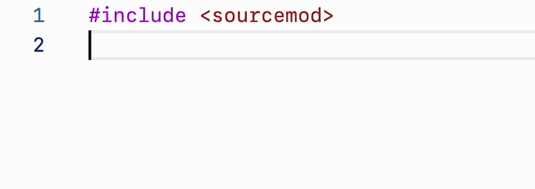
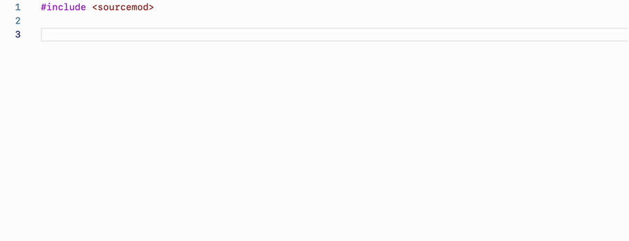
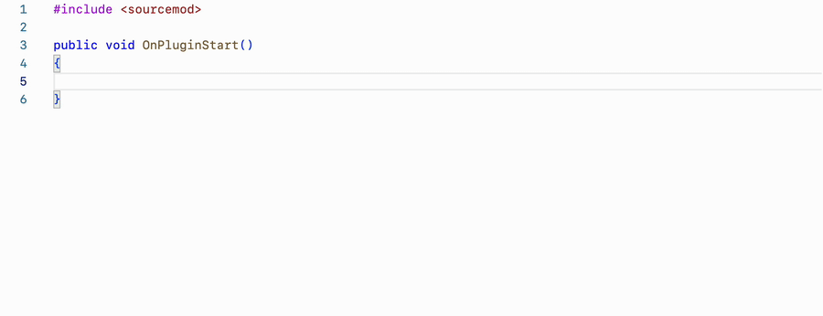

# Features

## Completions

When editing a file, the Language Server will suggest different completion suggestion based on the cursor's position and the infered surrounding context.

### Include completions

When writing an include statement, the Language Server will suggest available files and folders depending on what has already been typed. The results are different based on the include type (relative or absolute).

### Callback completions

Starting to type the name of a forward or a typedef, typeset, functag or a funcenum will suggest a list of snippet completions, which, when triggered, will insert a callback declaration for the corresponding elelement.

### Regular completions

Regular completions will suggest previously declared functions, variables, defines, etc. When writing a method or property access, only the relevant items will be suggested.

