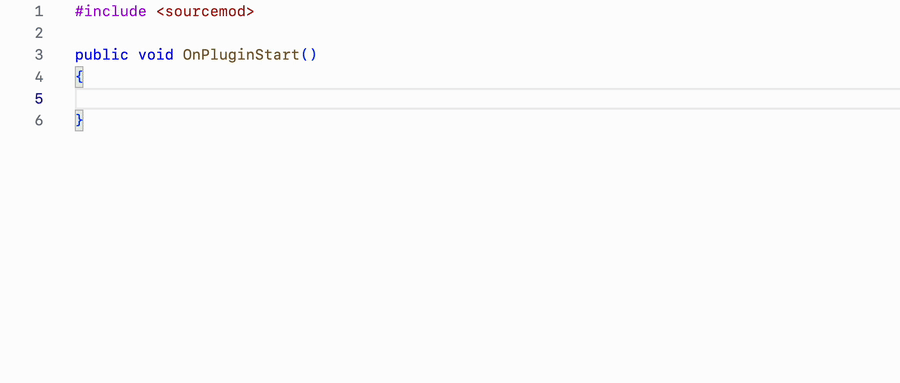
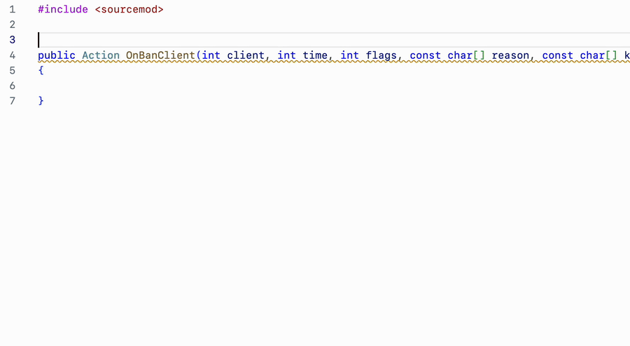

# Features

## Completions

When editing a file, the Language Server will suggest different completion suggestion based on the cursor's position and the infered surrounding context.

### Include completions

When writing an include statement, the Language Server will suggest available files and folders depending on what has already been typed. The results are different based on the include type (relative or absolute).

### Callback completions

Starting to type the name of a forward or a typedef, typeset, functag or a funcenum will suggest a list of snippet completions, which, when triggered, will insert a callback declaration for the corresponding elelement.

### Events completions

Opening the quotes in a call to `HookEvent`, `HookEventEx` or `UnhookEvent` will suggest all the known events with the game they belong to, as well as a description when available. To filter only a specific game, use the [`eventsGameName`](./configuration/generated_settings.md#eventsgamename) setting.

### Documentation completions

Above the definition of a function or a method, start typing `/*`, which will prompt to generate a doc comment template. Press enter to automatically insert a snippet doc comment which contains the name of your params and a return description if there is a return type other than `void`.

### Regular completions

Regular completions will suggest previously declared functions, variables, defines, etc. When writing a method or property access, only the relevant items will be suggested. Documentation for the selected suggestion is automatically displayed. Deprecated suggestions are indicated as such.

